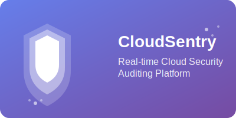
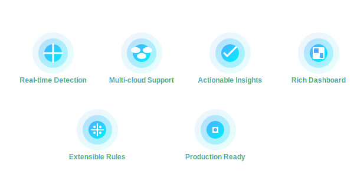
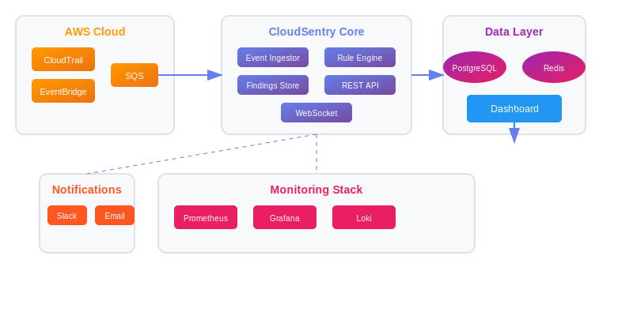
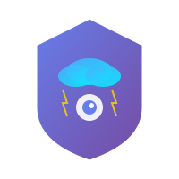

<div align="center">



# 🛡️ CloudSentry

## 🌐 Enterprise-grade Real-time Multi-cloud Security Auditing Platform

[](https://github.com/your-org/cloudsentry/actions/workflows/ci.yml)
[](https://github.com/your-org/cloudsentry/actions/workflows/security.yml)
[](https://codecov.io/gh/your-org/cloudsentry)
[](https://hub.docker.com/r/your-org/cloudsentry)
[](LICENSE)
[](https://www.python.org/)
[](https://fastapi.tiangolo.com/)
[](https://aws.amazon.com/cloudtrail/)
[](https://azure.microsoft.com/services/monitor/)
[](https://cloud.google.com/)

> **🚀 Your real-time cloud security guardian that never sleeps**

CloudSentry provides enterprise-grade, real-time security auditing for multi-cloud environments. Using an event-driven architecture, it immediately assesses the security impact of changes in your cloud infrastructure, providing instant visibility into security posture across AWS, Azure, and GCP.

---

## 🌟 Why Choose CloudSentry?

<div align="center">



</div>

### ⚡ **Unmatched Performance**
- **Real-time Detection**: Sub-second security assessment as changes happen
- **Event-driven Architecture**: Optimized for high-volume cloud environments
- **Scalable Processing**: Handle thousands of events per second

### 🔍 **Comprehensive Coverage**
- **Multi-cloud Support**: AWS, Azure, and GCP integration
- **Multi-account Management**: Centralized security across organizations
- **Cross-service Auditing**: Complete visibility across all cloud services

### 🎯 **Actionable Intelligence**
- **Prioritized Findings**: Severity-based security recommendations
- **Context-rich Insights**: Detailed impact analysis and remediation steps
- **Custom Rules Engine**: Tailor security policies to your needs

### 📊 **Beautiful Monitoring**
- **Real-time Dashboard**: Modern, responsive interface with live updates
- **Interactive Visualizations**: Rich charts and graphs for security metrics
- **Mobile-responsive**: Monitor security on any device

---

## 🏗️ Architecture Overview

<div align="center">



</div>

### 🌩️ **Cloud Integration Layer**
- **AWS CloudTrail**: EventBridge/SQS ingestion for real-time events
- **Azure Monitor**: Activity Logs and Resource Changes via Event Hubs
- **GCP Cloud Logging**: Pub/Sub integration for audit logs
- **Multi-account Support**: AWS Organizations and Azure Management Groups

### 🛡️ **CloudSentry Core**
- **Event Ingestor**: High-performance event normalization and processing
- **Rule Engine**: Extensible security rule evaluation framework
- **Findings Store**: Optimized storage for security findings
- **API Gateway**: RESTful and WebSocket APIs for real-time access

### 🗄️ **Data & Analytics**
- **PostgreSQL**: Primary database for findings and configuration
- **Redis**: High-speed caching and session management
- **Time-series Storage**: Historical security metrics and trends

### 📊 **Monitoring Stack**
- **Prometheus**: Metrics collection and alerting
- **Grafana**: Advanced dashboards and visualization
- **Loki**: Centralized log aggregation and analysis

---

## 🛡️ Security Rules Library

### 🔥 **Critical Security Rules**

| Rule ID | Description | Severity | Cloud | Resource |
|---------|-------------|----------|-------|----------|
| **S3-001** | S3 bucket allows public read access | **CRITICAL** | AWS | S3 Buckets |
| **EC2-001** | Security group allows SSH from 0.0.0.0/0 | **CRITICAL** | AWS | EC2 SG |
| **AZ-001** | Storage account allows public access | **CRITICAL** | Azure | Storage |
| **GCP-001** | Cloud Storage bucket is public | **CRITICAL** | GCP | GCS |

### ⚠️ **High Priority Rules**

| Rule ID | Description | Severity | Cloud | Resource |
|---------|-------------|----------|-------|----------|
| **IAM-002** | IAM policy allows full administrative privileges | **HIGH** | AWS | IAM Policies |
| **AZ-002** | VM allows RDP from internet | **HIGH** | Azure | Virtual Machines |
| **GCP-002** | Compute Engine has open SSH to world | **HIGH** | GCP | Compute Engine |

### 📊 **Medium Priority Rules**

| Rule ID | Description | Severity | Cloud | Resource |
|---------|-------------|----------|-------|----------|
| **S3-002** | S3 bucket has no encryption enabled | **MEDIUM** | AWS | S3 Buckets |
| **IAM-001** | IAM user has no MFA enabled | **MEDIUM** | AWS | IAM Users |
| **AZ-003** | Key Vault lacks soft delete | **MEDIUM** | Azure | Key Vault |

---

## 🚀 Quick Start

### 📋 Prerequisites

- **Docker** & **Docker Compose** (v20.10+)
- **Cloud Account** (AWS/Azure/GCP) with appropriate permissions
- **Python 3.9+** (for development)
- **Node.js 16+** (for dashboard development)

### 🛠️ 5-Minute Setup

```bash
# 1. Clone the repository
git clone https://github.com/your-org/cloudsentry.git
cd cloudsentry

# 2. Set up environment
cp .env.example .env
# Edit .env with your cloud credentials

# 3. Start all services
docker-compose up -d

# 4. Access the application
# Dashboard: http://localhost:3000
# API Docs: http://localhost:8000/docs
# WebSocket Test: http://localhost:8000/ws-test
```

### 🎯 Verify Installation

```bash
# Check service status
docker-compose ps

# View logs
docker-compose logs -f

# Test API
curl http://localhost:8000/health/detailed
```

---

## 📚 Comprehensive API Documentation

### 🔌 REST API Endpoints

**Base URL**: `https://your-domain.com/api/v1`

#### 🔍 **Findings Management**
```http
GET   /findings                    # List all findings with filtering
GET   /findings/{id}               # Get specific finding details
PATCH /findings/{id}/resolve       # Mark finding as resolved
POST  /findings/{id}/acknowledge   # Acknowledge finding
```

#### 📊 **Analytics & Statistics**
```http
GET   /findings/stats/summary     # Overall security summary
GET   /findings/stats/trends       # Historical trends
GET   /findings/stats/by-severity  # Findings by severity
GET   /findings/stats/by-account   # Findings by cloud account
```

#### 🛡️ **Rules Management**
```http
GET   /rules                       # List all security rules
GET   /rules/{id}                  # Get rule details
POST  /rules                       # Create custom rule
PUT   /rules/{id}                  # Update existing rule
```

#### 🔧 **System Management**
```http
GET   /health/detailed             # Comprehensive health check
POST  /audits/trigger              # Trigger manual audit
GET   /audits/status/{id}          # Check audit status
```

### 🌐 WebSocket API

**Connect to**: `wss://your-domain.com/ws`

#### **Real-time Events**
```json
{
  "type": "finding",
  "rule_id": "S3-001",
  "resource_id": "arn:aws:s3:::public-bucket",
  "severity": "CRITICAL",
  "timestamp": "2024-01-15T12:00:00Z",
  "account": "123456789012",
  "region": "us-east-1",
  "description": "S3 bucket allows public read access",
  "remediation": "Remove public access policy and enable bucket ACL restrictions"
}
```

---

## 🔧 Advanced Configuration

### 🌍 Environment Variables

| Variable | Description | Default | Required |
|----------|-------------|---------|----------|
| **Cloud Provider Settings** |
| `AWS_REGION` | AWS region for auditing | `us-east-1` | Yes |
| `AWS_ACCESS_KEY_ID` | AWS access key ID | - | Yes |
| `AWS_SECRET_ACCESS_KEY` | AWS secret access key | - | Yes |
| `AZURE_SUBSCRIPTION_ID` | Azure subscription ID | - | Yes |
| `AZURE_CLIENT_ID` | Azure service principal ID | - | Yes |
| `AZURE_CLIENT_SECRET` | Azure service principal secret | - | Yes |
| `GCP_PROJECT_ID` | Google Cloud project ID | - | Yes |
| `GCP_CREDENTIALS_PATH` | Path to GCP service account key | - | Yes |
| **Multi-account Settings** |
| `ENABLE_MULTI_ACCOUNT` | Enable multi-account support | `false` | No |
| `MEMBER_ACCOUNT_ROLE_NAME` | IAM role for member accounts | `CloudSentryAuditRole` | No |
| **Database Settings** |
| `DATABASE_URL` | PostgreSQL connection string | - | Yes |
| `REDIS_URL` | Redis connection string | - | Yes |
| **Notification Settings** |
| `SLACK_WEBHOOK_URL` | Slack webhook for notifications | - | No |
| `SMTP_HOST` | SMTP server for email notifications | - | No |
| `SMTP_PORT` | SMTP port | `587` | No |
| `SMTP_USERNAME` | SMTP username | - | No |
| `SMTP_PASSWORD` | SMTP password | - | No |

---

## 🧪 Comprehensive Testing Suite

### 🏃 Running Tests

```bash
# Run all tests with coverage
pytest --cov=app --cov-report=html --cov-report=term

# Run specific test categories
pytest tests/unit/ -v                    # Unit tests
pytest tests/integration/ -v             # Integration tests  
pytest tests/security/ -v                 # Security tests
pytest tests/performance/ -v             # Performance tests
pytest tests/multi_cloud/ -v             # Multi-cloud tests

# Run with specific markers
pytest -m "not slow"                      # Skip slow tests
pytest -m "security"                      # Security tests only
```

---

## 📊 Advanced Monitoring & Alerting

### 📈 Default Grafana Dashboards

| Dashboard | Description | Key Metrics |
|-----------|-------------|-------------|
| **CloudSentry Overview** | Main operational dashboard | Event rate, findings count, system health |
| **Security Posture** | Security metrics and trends | Risk score, compliance status, threat landscape |
| **API Performance** | API monitoring | Request rate, latency, error rates |
| **Database Health** | Database performance | Connection pool, query performance, storage |
| **Multi-cloud Overview** | Cross-cloud metrics | Account coverage, service distribution |

### 🚨 Intelligent Alerting

#### **Critical Alerts**
- **System downtime** > 30 seconds
- **Critical security findings** detected
- **Data breach indicators** identified
- **Authentication failures** > 100/min

#### **Warning Alerts**  
- **API error rate** > 5% for 2 minutes
- **Database connections** > 80% capacity
- **Memory usage** > 85%
- **Disk space** < 15% available

---

## 🚢 Production Deployment Guide

### 🐳 Docker Compose Deployment

```bash
# Development environment
docker-compose up -d

# Production with optimizations
docker-compose -f docker-compose.yml -f docker-compose.production.yml up -d

# Scale services
docker-compose up -d --scale api=3 --scale worker=5
```

### ☸️ Kubernetes Deployment

```bash
# Install using Helm
helm repo add cloudsentry https://charts.cloudsentry.io
helm install cloudsentry cloudsentry/cloudsentry \
  --set cloudProvider.aws.enabled=true \
  --set monitoring.grafana.enabled=true \
  --set notifications.slack.webhookUrl=$SLACK_WEBHOOK

# Upgrade deployment
helm upgrade cloudsentry cloudsentry/cloudsentry -f values.yaml

# Rollback if needed
helm rollback cloudsentry 1
```

---

## 🔐 Enterprise Security Features

### 🛡️ Built-in Security Controls

- **Rate Limiting**: Configurable API rate limits per endpoint
- **Input Validation**: Comprehensive input sanitization and validation
- **SQL Injection Prevention**: Parameterized queries and ORM protection
- **XSS Protection**: Content Security Policy and output encoding
- **CSRF Protection**: Token-based CSRF validation
- **Security Headers**: HSTS, X-Frame-Options, X-Content-Type-Options

---

## 🤝 Contributing to CloudSentry

We welcome contributions from the community! Here's how to get started:

### 📋 Contribution Workflow

1. **🍴 Fork** the repository
2. **🌿 Create a feature branch** (`git checkout -b feature/amazing-feature`)
3. **✏️ Commit your changes** (`git commit -m 'Add amazing feature'`)
4. **📦 Push to branch** (`git push origin feature/amazing-feature`)
5. **🔀 Open a Pull Request**

### 📝 Development Guidelines

- ✅ **Write comprehensive tests** for new features
- ✅ **Update documentation** (README, API docs, code comments)
- ✅ **Follow PEP 8** style guide with Black formatting
- ✅ **Use type hints** throughout the codebase
- ✅ **Add security considerations** for new features
- ✅ **Include performance implications** in documentation

---

## 📄 License & Legal

**License**: MIT License - see the [LICENSE](LICENSE) file for details.

**Copyright**: © 2024 CloudSentry Contributors

**Trademark**: CloudSentry™ is a trademark of CloudSentry Inc.

---

## 🙏 Acknowledgments & Credits

### 🌟 Core Technologies
- **AWS** - CloudTrail, EventBridge, and security services
- **Microsoft Azure** - Monitor, Activity Logs, and security tools  
- **Google Cloud Platform** - Cloud Logging, Pub/Sub, and security APIs
- **FastAPI** - Modern, fast web framework for building APIs
- **React** - JavaScript library for building user interfaces
- **PostgreSQL** - Powerful open source database
- **Redis** - In-memory data structure store
- **Grafana** - The open observability platform
- **Prometheus** - Monitoring system and time series database

---

## 📞 Support & Community

### 🆘 Get Help

| Channel | Link | Response Time |
|---------|------|---------------|
| **🐛 GitHub Issues** | [Report a Bug](https://github.com/your-org/cloudsentry/issues) | 24-48 hours |
| **💬 GitHub Discussions** | [Community Forum](https://github.com/your-org/cloudsentry/discussions) | Community response |
| **📧 Email Support** | [support@cloudsentry.io](mailto:support@cloudsentry.io) | 24 hours |
| **💬 Slack Community** | [Join our Slack](https://cloudsentry.slack.com) | Real-time |
| **📖 Documentation** | [docs.cloudsentry.io](https://docs.cloudsentry.io) | Self-service |

---

<div align="center">

## 🛡️ CloudSentry

### Your real-time cloud security guardian

*Built with ❤️ for the cloud security community*

---

[🚀 Get Started](#-quick-start) • [📚 Documentation](#-comprehensive-api-documentation) • [🤝 Contributing](#-contributing-to-cloudsentry) • [📞 Support](#-support--community)

---



**⭐ Star us on GitHub** | **🐦 Follow us on Twitter** | **📧 Subscribe to our newsletter**

</div>
