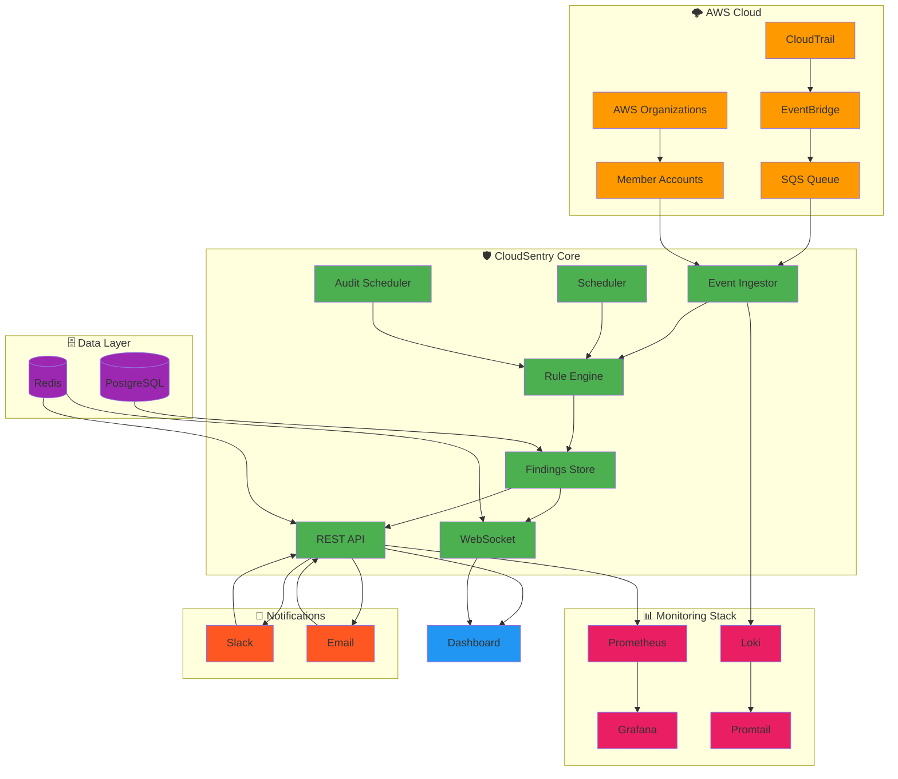

<div align="center">

# 🛡️ CloudSentry

## Real-time Multi-cloud Security Auditing Platform

[](https://github.com/your-org/cloudsentry/actions/workflows/ci.yml)
[](https://github.com/your-org/cloudsentry/actions/workflows/security.yml)
[](https://codecov.io/gh/your-org/cloudsentry)
[](https://hub.docker.com/r/your-org/cloudsentry)
[](LICENSE)
[](https://www.python.org/)
[](https://fastapi.tiangolo.com/)

> **Your real-time cloud security guardian** 🚀

CloudSentry provides enterprise-grade, real-time security auditing for multi-cloud environments. Using an event-driven architecture, it immediately assesses the security impact of changes in your cloud infrastructure, providing instant visibility into security posture.

---

## 🌟 Why CloudSentry?

- **⚡ Real-time Detection**: Instant security assessment as changes happen
- **🔍 Comprehensive Coverage**: Multi-account, multi-service security monitoring
- **🎯 Actionable Insights**: Clear, prioritized security findings
- **📊 Rich Dashboard**: Beautiful, real-time monitoring interface
- **🔧 Extensible Rules**: Custom security rules for your specific needs
- **🚀 Production Ready**: Enterprise-grade deployment and monitoring

---

## 🚀 Features

### 🏗️ Core Architecture

#### **Real-time Event Processing**
- ✅ **AWS CloudTrail Integration**: EventBridge/SQS ingestion
- ✅ **Event Normalization**: Standardized event processing
- ✅ **Multi-account Support**: AWS Organizations integration
- ✅ **Cross-account Auditing**: Centralized security monitoring

#### **Security Rule Engine**
- ✅ **Modular Rules**: Extensible rule framework
- ✅ **AWS API Integration**: Real-time resource validation
- ✅ **Custom Rules**: Write your own security logic
- ✅ **Rule Prioritization**: Severity-based alerting

#### **Real-time Dashboard**
- ✅ **React-based UI**: Modern, responsive interface
- ✅ **WebSocket Streaming**: Live updates
- ✅ **Interactive Visualizations**: Charts and graphs
- ✅ **Mobile Responsive**: Works on all devices

#### **Comprehensive API**
- ✅ **REST API**: Full CRUD operations
- ✅ **WebSocket API**: Real-time streaming
- ✅ **OpenAPI Documentation**: Auto-generated docs
- ✅ **Rate Limiting**: Built-in protection

#### **Background Processing**
- ✅ **Scheduled Audits**: Periodic full security scans
- ✅ **Celery Workers**: Scalable task processing
- ✅ **Queue Management**: Reliable job processing
- ✅ **Task Monitoring**: Real-time job status

### 🛡️ Security Rules Included

| Rule ID | Description | Severity | Resource |
|---------|-------------|----------|----------|
| **S3-001** | S3 bucket allows public read access | HIGH | S3 Buckets |
| **S3-002** | S3 bucket has no encryption enabled | MEDIUM | S3 Buckets |
| **EC2-001** | Security group allows SSH from 0.0.0.0/0 | HIGH | EC2 SG |
| **EC2-002** | Security group allows RDP from 0.0.0.0/0 | HIGH | EC2 SG |
| **IAM-001** | IAM user has no MFA enabled | MEDIUM | IAM Users |
| **IAM-002** | IAM policy allows full administrative privileges | CRITICAL | IAM Policies |

---

## 🏗️ Architecture



---

## 🚀 Quick Start

### 📋 Prerequisites

- **Docker** & **Docker Compose**
- **AWS Account** with appropriate permissions
- **Python 3.9+** (for development)

### 🛠️ Development Setup

```bash
# Clone the repository
git clone https://github.com/your-org/cloudsentry.git
cd cloudsentry

# Set up environment
cp .env.example .env
# Edit .env with your AWS credentials

# Start all services
docker-compose up -d

# Access the application
# Dashboard: http://localhost:3000
# API Docs: http://localhost:8000/docs
# WebSocket Test: http://localhost:8000/ws-test
```

### 🚢 Production Deployment

```bash
# Set up production environment
cp .env.production.example .env.production
# Edit .env.production with production values

# Deploy to production
./deployments/deploy-production.sh

# Access production instance
# Dashboard: https://your-domain.com
# API: https://your-domain.com/api/v1
# Grafana: https://your-domain.com:3001
```

---

## 📚 API Documentation

### 🔌 REST API

**Base URL**: `https://your-domain.com/api/v1`

| Endpoint | Method | Description |
|----------|--------|-------------|
| `/findings` | GET | List security findings with filtering |
| `/findings/{id}` | GET | Get specific finding details |
| `/findings/stats/summary` | GET | Get findings summary statistics |
| `/rules` | GET | List all security rules |
| `/audits/trigger` | POST | Trigger manual security audit |
| `/health/detailed` | GET | Detailed system health check |

### 🌐 WebSocket API

**Connect to**: `wss://your-domain.com/ws`

**Message Format**:
```json
{
  "type": "finding",
  "rule_id": "S3-001",
  "resource_id": "test-bucket",
  "severity": "HIGH",
  "timestamp": "2024-01-15T12:00:00Z",
  "description": "S3 bucket allows public read access"
}
```

---

## 🔧 Configuration

### 🌍 Environment Variables

| Variable | Description | Default | Required |
|----------|-------------|---------|----------|
| `AWS_REGION` | AWS region for auditing | `us-east-1` | Yes |
| `AWS_ACCESS_KEY_ID` | AWS access key ID | - | Yes |
| `AWS_SECRET_ACCESS_KEY` | AWS secret access key | - | Yes |
| `ENABLE_MULTI_ACCOUNT` | Enable multi-account support | `false` | No |
| `MEMBER_ACCOUNT_ROLE_NAME` | IAM role for member accounts | `CloudSentryAuditRole` | No |
| `SLACK_WEBHOOK_URL` | Slack webhook for notifications | - | No |
| `SMTP_HOST` | SMTP server for email notifications | - | No |
| `DATABASE_URL` | PostgreSQL connection string | - | Yes |
| `REDIS_URL` | Redis connection string | - | Yes |

### ➕ Adding Custom Rules

**1. Create a new rule** in `app/engine/rules/`:

```python
from app.engine.rules.base_rule import BaseRule
from typing import Dict, Any, Optional

class MyCustomRule(BaseRule):
    def __init__(self):
        super().__init__(
            rule_id="CUSTOM-001",
            description="My custom security rule",
            severity="HIGH",
            resource_types=["ec2", "s3"]
        )
    
    async def evaluate(self, event: Dict[str, Any], resource_state: Optional[Dict] = None) -> Optional[Dict]:
        """Evaluate if the event violates this security rule"""
        if self._check_condition(event):
            return self.create_finding(event, resource_state)
        return None
    
    def _check_condition(self, event: Dict[str, Any]) -> bool:
        """Your custom rule logic here"""
        # Example: Check for specific configuration
        return event.get("eventName") == "CreateSecurityGroup" and \
               "0.0.0.0/0" in str(event.get("requestParameters", {}))
```

**2. Register the rule** in `app/engine/rule_engine.py`:

```python
from app.engine.rules.my_custom_rule import MyCustomRule

class RuleEngine:
    def __init__(self):
        self.rules = [
            # ... existing rules
            MyCustomRule()
        ]
```

---

## 🧪 Testing

### 🏃 Running Tests

```bash
# Run all tests
pytest

# Run specific test categories
pytest tests/unit/ -v          # Unit tests
pytest tests/integration/ -v   # Integration tests
pytest tests/performance/ -v   # Performance tests
pytest tests/security/ -v       # Security tests

# Run with coverage
pytest --cov=app --cov-report=html

# Run in CI mode
python -m pytest --cov=app --cov-report=xml
```

### 📊 Test Coverage

- **Unit Tests**: Core business logic
- **Integration Tests**: API endpoints and database
- **Security Tests**: Input validation and authentication
- **Performance Tests**: Load and stress testing

---

## 📊 Monitoring & Alerting

### 📈 Default Dashboards

| Dashboard | Description |
|-----------|-------------|
| **CloudSentry Overview** | Main dashboard with key metrics |
| **API Performance** | Request rates, latency, error rates |
| **Database Monitoring** | Connection pool, query performance |
| **Redis Monitoring** | Memory usage, hit rates |
| **Security Findings** | Findings by severity, account, resource type |

### 🚨 Alert Rules

- **API downtime** > 1 minute
- **Error rate** > 5% for 2 minutes
- **Database connections** > 50
- **Redis memory** > 80%
- **Critical security findings** detected

---

## 🚢 Deployment Options

### 🐳 Docker Compose

```bash
# Development
docker-compose up -d

# Production
docker-compose -f docker-compose.yml -f docker-compose.production.yml up -d
```

### ☸️ Kubernetes (Helm)

```bash
# Install Helm chart
helm install cloudsentry ./charts/cloudsentry

# Upgrade deployment
helm upgrade cloudsentry ./charts/cloudsentry
```

### ☁️ AWS ECS

```bash
# Build and push image
aws ecr get-login-password | docker login --username AWS --password-stdin AWS_ACCOUNT_ID.dkr.ecr.REGION.amazonaws.com
docker build -t cloudsentry .
docker tag cloudsentry:latest AWS_ACCOUNT_ID.dkr.ecr.REGION.amazonaws.com/cloudsentry:latest
docker push AWS_ACCOUNT_ID.dkr.ecr.REGION.amazonaws.com/cloudsentry:latest

# Deploy to ECS
aws ecs update-service --cluster cloudsentry-cluster --service cloudsentry-service --force-new-deployment
```

---

## 🔐 Security

### 🛡️ Security Features

- **Rate limiting** on API endpoints
- **Security headers** (CSP, HSTS, XSS protection)
- **SQL injection prevention**
- **Input validation and sanitization**
- **JWT authentication ready**
- **Secrets management** with AWS Secrets Manager

### 🔒 Security Best Practices

- Use **IAM roles** instead of access keys when possible
- Enable **encryption at rest** for database
- Use **SSL/TLS** for all communications
- Regular **security updates** and patches
- Monitor **audit logs** for suspicious activity

---

## 🤝 Contributing

We welcome contributions! Here's how to get started:

### 📋 Contribution Process

1. **Fork** the repository
2. **Create a feature branch** (`git checkout -b feature/amazing-feature`)
3. **Commit your changes** (`git commit -m 'Add amazing feature'`)
4. **Push to branch** (`git push origin feature/amazing-feature`)
5. **Open a Pull Request**

### 📝 Development Guidelines

- ✅ **Write tests** for new features
- ✅ **Update documentation**
- ✅ **Follow PEP 8** style guide
- ✅ **Use type hints** where possible
- ✅ **Add comments** for complex logic

---

## 📄 License

This project is licensed under the **MIT License** - see the [LICENSE](LICENSE) file for details.

---

## 🙏 Acknowledgments

- **AWS** for CloudTrail and EventBridge
- **FastAPI** for the excellent web framework
- **React** for the dashboard frontend
- **Grafana** for monitoring dashboards
- **Prometheus** for metrics collection
- All **open-source libraries** used in this project

---

## 📞 Support

| Channel | Link |
|---------|------|
| **Issues** | [GitHub Issues](https://github.com/your-org/cloudsentry/issues) |
| **Discussions** | [GitHub Discussions](https://github.com/your-org/cloudsentry/discussions) |
| **Email** | [support@cloudsentry.io](mailto:support@cloudsentry.io) |
| **Slack** | [Join our Slack](https://cloudsentry.slack.com) |

---

<div align="center">

## 🛡️ CloudSentry

### Your real-time cloud security guardian

*Built with ❤️ for the cloud security community*

---

[🚀 Get Started](#-quick-start) • [📚 Documentation](#-api-documentation) • [🤝 Contributing](#-contributing) • [📞 Support](#-support)

</div>